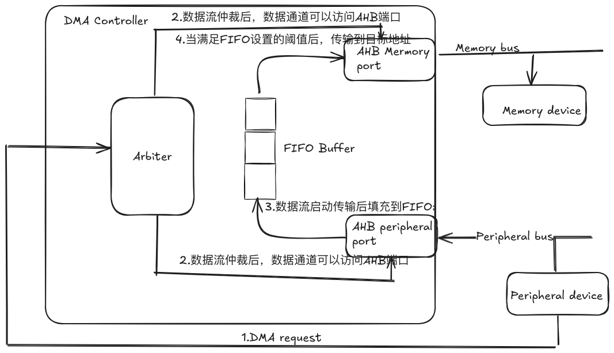
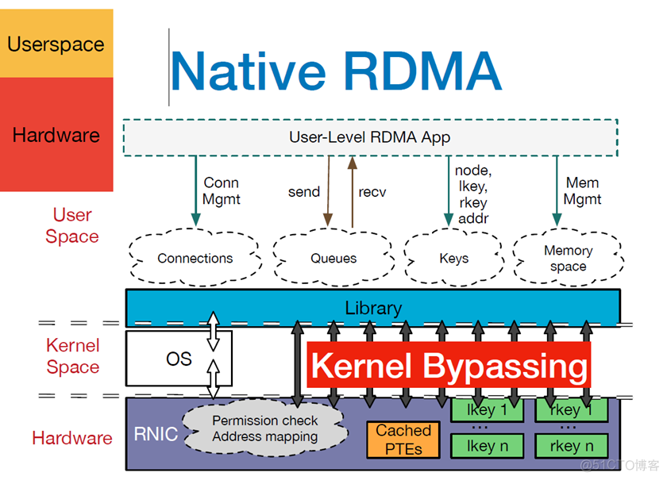
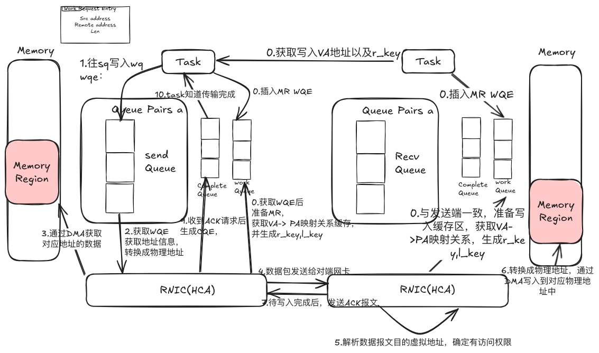

当前AI训练中，由于大量的数据发送，使用传统的网络协议的网络包发送都需要通过内核进行发送，就会涉及到数据层从用户态和内核态拷贝，在大模型训练以及推理场景下，可能需要在gpu/npu之间有大量的数据的传输，这样涉及在发送和接收端的大量的内存拷贝，导致收发端大量的资源消耗以及处理延迟。可能有些人不大熟悉网络收发的流程，那先来介绍下linux中网络收发包的流程．
### 网络收发

那么从上图看到，左边的tasks要发送一个包的时候，有以下几个流程：
1. 进程调用send系统调用发送数据，系统调用中会申请一个skb，将用户待发送的数据拷贝到skb中，经过协议栈处理放入到发送队列ringbuffer中
2. 网卡驱动从发送队列ringbuffer中获取skb，发送到数据包，这个时候占用的是用户进程的系统态时间（sy），只有当用户进程的时间quota用完后，或者其他进程需要cpu时，会触发软中断进行发送。这里的软中断类型为NET_TX。发送完成后会通过硬中断来通知cpu已经发送完成，其实这里有个特别的，这里发送的硬中断类型是Net_RX_SOFTIRQ,这里也是为什么我们通过服务器上/proc/softiqrs里为什么NET_RX比NET_TX多很多的原因。
4. 接收到中断后，cpu会清理传输队列的ringbuffer
那么数据到达对端的网卡会做哪些操作呢？如图所示：
1. 当数据到达网卡时，网卡驱动会将数据包dma到接收队列的ringbuffer中，然后发送硬中断通知cpu有数据到达
2. cpu接收到硬中断后，会调用网卡驱动注册的硬中断处理函数，一般来说为了保证cpu的工作效率，避免中断长期占用cpu，中断处理函数简单处理后，触发软中断，由软中断进程ksoftirqd来真正调用网卡驱动注册的poll函数收包。一般来说，由几个核就会启动几个软中断处理的进程。一般来说由硬中断是谁响应的一般会由对应的软中断也在这个cpu进行处理。如果由于网络接收某个cpu si偏高，可以通过加大网卡多队列，通过设置中断亲和，来把各个队列的中断打散到各个cpu上。
3. 接收完数据包后往上交由协议栈处理，放入用户进程接收队列中，然后通知cpu唤醒进程，进行后续操作
### RDMA
那为了减少传送数据的资源消耗以及处理时延，一般都会使用RDMA（Remote Direct Memory Access）。可能有些人没有了解过DMA，对于RDMA为什么能解决问题也是一知半解，所以接下来新介绍DMA
#### DMA
DMA是一种数据传输方式，他提供了为存储设备与外部设备之间提供了一种不经过cpu干预的数据传输方式，这样可以提升系统性能，使CPU专心处理一起更重要的计算任务。那通过外设到存储器的数据传输来简单看一下DMA数据传输的流程

整体的数据传输通过DMA Controller来控制，当外部设备想传输数据到一块内存，
1. 首先外部设备发送DMA request到DMA Controller，DMA Controller会根据DMA通道的优先级来处理请求
2. 当DMA Controller响应传输请求时会向控制总线发起总线控制请求，暂停CPU访问，获取系统总线控制权，当获取总线控制权后，数据流通道被开启，数据通道可以访问AHB源和目的端口
3. 外部设备会通过AHB peripheral端口将数据流发送到内部的FIFO队列
4. 当FIFO队列达到设置的阈值后，会通过AHB memory端口通过总线发送到存储设备，这里的FIFO的阈值可以根据情况设置，设置值可以为25%，50%，75%等
5. 当传输完成后，可以根据是否发送中断请求，来看是否给cpu发送中断请求，可以通过例如预置的中断响应请求来对对应的请求进行响应，同时释放总线控制权。
这里大概描述了一个外设到存储器的DMA请求的流程，那存储器到外设，存储器到存储器都是类似的流程,可能会有些细微差别
#### RDMA
那其实RDMA其实是绕过cpu，不仅能访问本机的内存，还有访问另一台主机的内存，这样可以节省大量的cpu资源，也提升了系统吞吐，在当前高性能计算以及大模型训练与推理的场景下广泛应用。
RDMA有以下几个特点：
- cpu offload:应用程序可以不需要远端服务器参与，读取远端服务器主机内存。
- Kernel bypass: rdma提供专有interface，应用程度可以在用户态执行数据传输，不需要在哪喝态与用户态做上下文切换
- Zero copy:数据能直接发送到缓冲区或者从缓冲区读取，需要要被复制到网络层。

引用下往上很多blog里都用的图，用户程序例如大模型训练框架等通过verbs接口操作RDMA NIC，其中有两种基本的verb：
- Memory verb: 主要是RDMA read/write,调用者指定远程/本机虚拟地址，进行远程虚拟机的读写。但是与Message verbs不同的是远程主机是不会意识到操作正在执行，但是在使用该verb前需要提前注册Memory Region，一个是可以注册VA到PA的地址转换到RNIC的Cached PTEs。这样数据需要发送/收取时，Host Channel Adatpter通过查询Cached PTEs来获取PA，读取数据或者将写入的数据写入到对应的地址。同时注册Memory Region，会产生两把密钥，r_key（remote key）和l_key（local key），用于保障对于本端和远端内存区域的访问权限。
- Message verb:主要是send/recevive，被称为双端操作，与memory verb的最大区别在于需要双方的cpu参与，主要用户两端交换控制信息，比如说上诉Memory VA以及key，大量的数据操作还是通过RDMA read/write完成。发送端和接收端都要给过Work Request来通知硬件接收和发送的地址在哪里。
那接下来我们通过一个RDMA的Write来大概描述下整个通信过程，如下图所示：

RDMA-Write如前文所述，需要应用提前准备虚拟地址,比如接收方要自己准备数据写入地址，同也需要注册MemoryRegion，提前注册RNIC相关的VA->PA的转换表以及相应写入权限key，避免远端写入一些非期望地址
##### 准备阶段
- 发送端会向WorkQueue中插入一个MemoryRegionEntry，HCA会获取队列中的Work Request，注册MemoryRegion，获取VA->PA的地址转换表，并生成r_key,l_key供后续使用。同样接收端也会做响应事情，会准备写入的地址，然后同时注册MemoryRegion。
- 其实会通知发送端，数据写入到哪个虚拟地址，以及可以操作该地址的r_key
##### Write
1. 发送端会通过lib库调用write命令，指定src address, dst address, data Len, key and so on. lib库会转换成一个WorkRequest插入到Send Queue
2. HCA异步从SendQueue中获取Work Request，解析信息，获取网卡的虚拟地址，经过鉴权后，转换成物理地址。
3. HCA通过DMA获取内存中数据
4. HCA将内存中的数据组装成数据报文发送给接收端网卡
5. 接收端HCA接收到数据后，解析虚拟地址，鉴权，将目标虚拟地址转换为物理地址
6. HCA通过DMA讲数据写入到指定的内存区域
7. 待数据写入完成后，接收端回复ACK
8. 发送端HCA接收到ACK报文后，生成Complete Queue Entry,插入到CQ中
9. 发送端Task通过CompleteQueue感知数据发送完成
以上就是个大概的RDMA write的过程，其实Read也类似；RDMA由自己的通信协议，那当前业界也有几种不同的硬件实现
- Infiniband:依赖专有的IB网卡以及交换机，性能是肯定最优，他的唯一缺点就是贵，除了贵还是贵，我等穷人不配看到他。同时还有个问题是厂商垄断问题。
- iWARP(Internet Wide Area RDMA Protocol):基于TCP/IP的RDMA技术，在标准以太网上实现RDMA，不需要交换机实现无损以太网，但是需要服务器支持iWARP网卡。虽然不受限于硬件，但是受限于TCP性能。
- RoCE(RDMA over Converged Ethernet):当前RoCE v2是基于以太网中UDP协议实现，需要交换机开启无损以太网(因为报文丢失对上层传输影响较大)，是当前最有效的以太网低延迟方案，相对IB肯定是性能不足，但胜在便宜一些，但是差不多要一半的价格 

